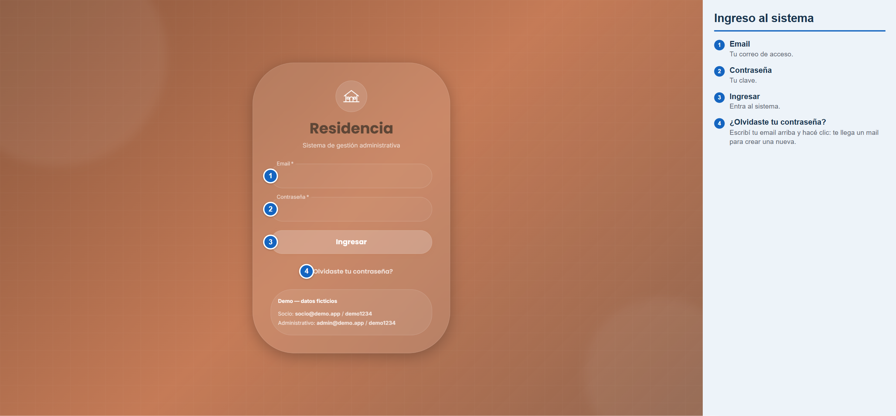
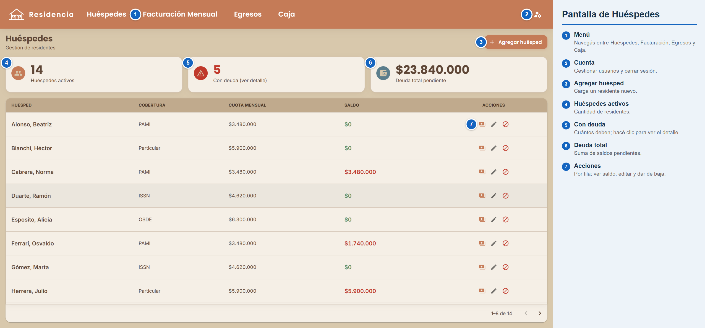
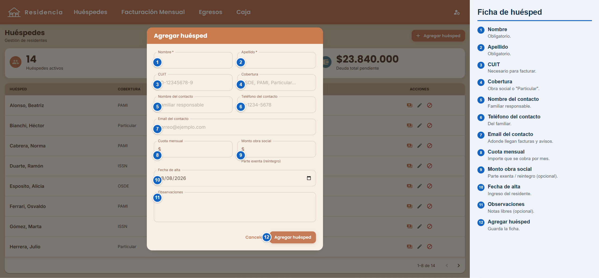
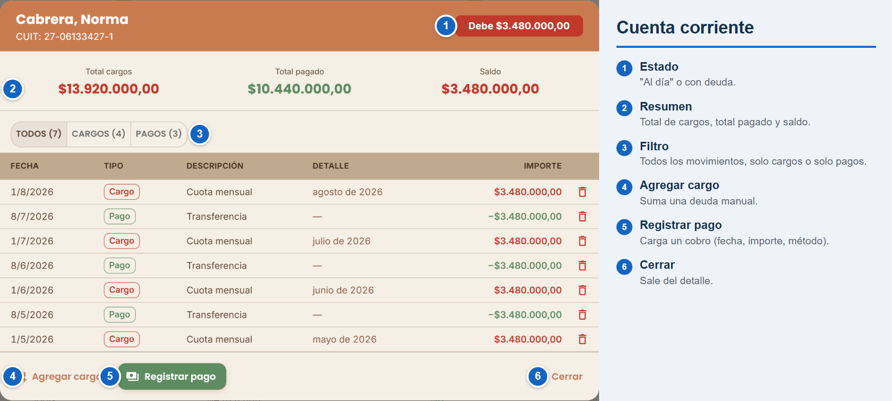
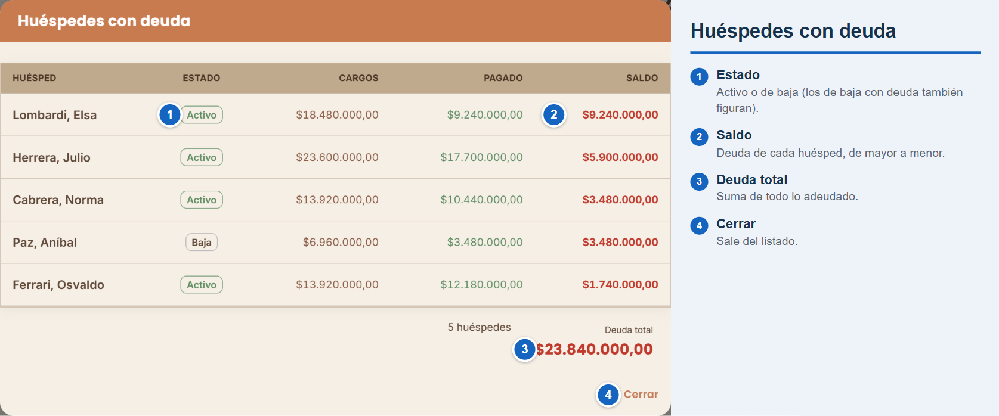
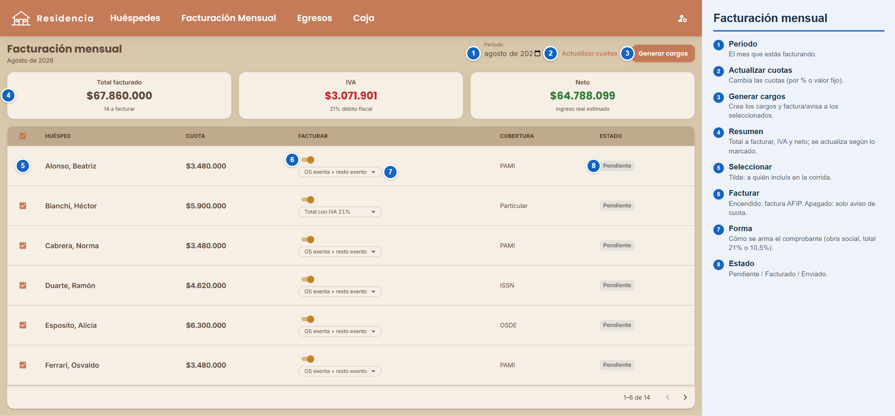
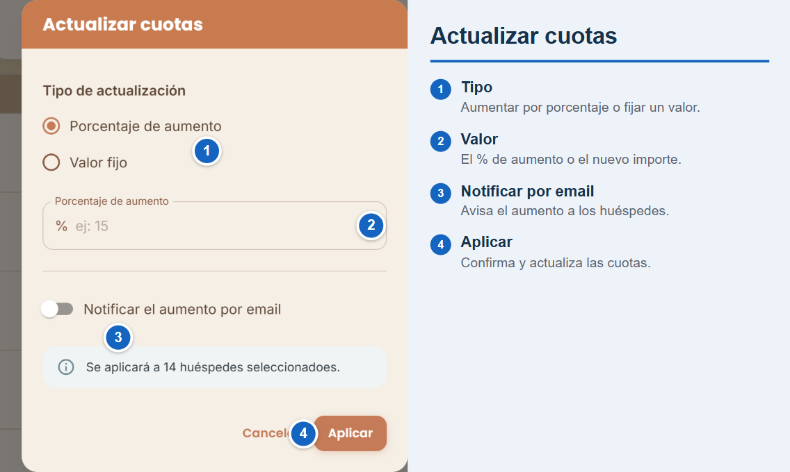
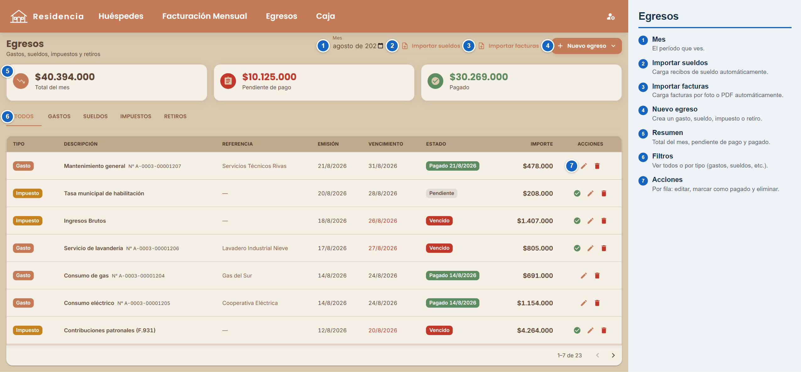
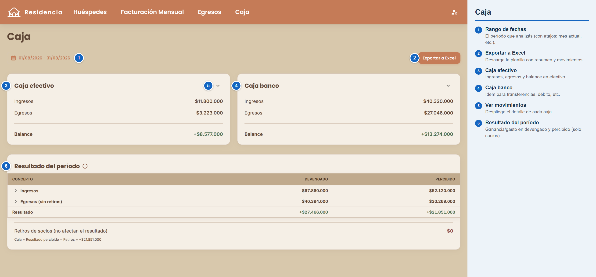
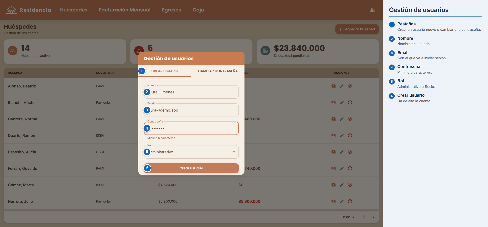

# Residencia — Manual de uso

Guía paso a paso del sistema de gestión de la residencia. Cada sección tiene la pantalla
correspondiente con **indicaciones sobre qué hace cada botón y qué se carga en cada campo**.

---

## 1. Ingreso al sistema

1. Escribí tu **email** y tu **contraseña**.
2. Presioná **Ingresar**.

**¿Olvidaste tu contraseña?** Escribí tu email en el campo de arriba y hacé clic en el enlace:
te llega un correo con un botón para crear una contraseña nueva.

---

## 2. Huéspedes

Es la pantalla principal. Arriba, tres tarjetas te dan la foto rápida:

- **Huéspedes activos** — cuántos residentes hay.
- **Con deuda** — cuántos deben. *Hacé clic para ver el detalle de deudores.*
- **Deuda total** — cuánto se debe en total.

Debajo, la lista de huéspedes con su cobertura, cuota y saldo.

### 2.1 Cargar o editar un huésped

Con **Agregar huésped** se abre la ficha. Campos:

- **Nombre y Apellido** — obligatorios.
- **CUIT** — necesario para poder **facturar** al huésped.
- **Cobertura** — obra social o "Particular".
- **Contacto** (nombre, **email**, teléfono) — el **email** es adonde llegan las facturas y avisos.
- **Cuota mensual** — el importe que se cobra cada mes.
- **Monto obra social** — la parte exenta (reintegro), si corresponde.

> Dar de **baja** a un huésped no lo borra: queda inactivo, pero su deuda sigue figurando.

### 2.2 Cuenta corriente (ver saldo)

Muestra **cargos** (lo que debe) y **pagos** (lo que abonó), ordenados por fecha. Desde acá podés:

- **Agregar cargo** — sumar una deuda manual.
- **Registrar pago** — fecha, importe y método (efectivo, transferencia, etc.).
- **Eliminar** un cargo o un pago (el saldo se recalcula solo).

### 2.3 Deudores

La tarjeta **Con deuda** abre la lista de todos los que tienen saldo pendiente (incluidos los
que están de baja), ordenados de mayor a menor deuda.

---

## 3. Facturación mensual

Acá se generan los cargos del mes y se emiten las **facturas** o se envían **avisos de cuota**.

- **Período** — el mes que estás facturando.
- **Tarjetas** (Total / IVA / Neto) — se actualizan según a quiénes marques.
- **Tabla**, por huésped:
  - **Tilde (checkbox)** — a quién incluís en la corrida.
  - **Facturar** — encendido: emite **factura AFIP**; apagado: manda solo un **aviso de cuota**.
  - **Forma** — cómo se arma el comprobante (con obra social, total al 21% o al 10,5%).

**Generar cargos** procesa a los seleccionados: crea la cuota del mes, factura a los que tienen
"Facturar" encendido y avisa a los demás. A un huésped ya facturado no se lo vuelve a facturar.

### 3.1 Actualizar cuotas

Actualiza la cuota de los seleccionados por **porcentaje** o **valor fijo**, y opcionalmente
**avisa el aumento por email**.

---

## 4. Egresos

Registro de todas las salidas de dinero, con filtros por **mes** y **tipo**. Con el botón de
nuevo egreso elegís:

- **Gasto** — proveedor, rubro, concepto e importe.
- **Sueldo** — empleado, período y desglose.
- **Impuesto** — concepto, importe y vencimiento.
- **Retiro** — socio, importe y origen.

En cada uno, el interruptor **"Ya está pagado"** despliega el método y la fecha de pago. Si queda
pendiente, después se usa **Marcar como pagado**. *Solo los egresos pagados entran en la caja.*

---

## 5. Caja

Muestra el movimiento de dinero del período elegido (con el selector de fechas y sus atajos).

- **Caja efectivo** y **Caja banco** — ingresos, egresos y balance de cada una, con el detalle
  de movimientos desplegable.
- **Resultado del período** — cuánto se ganó/gastó (visible para socios).
- **Exportar a Excel** — descarga una planilla con el resumen y los movimientos de ambas cajas.

---

## 6. Gestión de usuarios

Desde el ícono de **cuenta** (arriba a la derecha) → **Gestionar usuarios**:

- **Crear usuario** — nombre, email, contraseña y rol.
- **Cambiar contraseña** — se elige el usuario, se pone su contraseña actual y la nueva.

---

*Ante cualquier duda, escribinos.*
